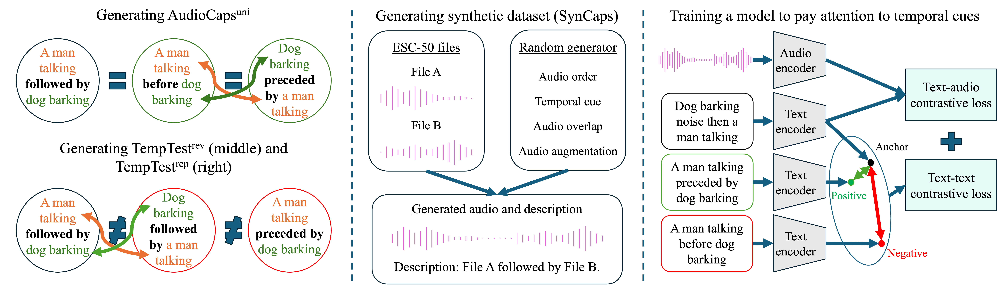

# Dissecting Temporal Understanding in Text-to-Audio Retrieval

[Project page](https://github.com/oncescuandreea/DTU_text_audio) | [arXiv](https://openreview.net/pdf?id=HTZy9hpoYV)



## Downloading pre-trained models needed for experiments:
Download HTSAT.ckp model from [here](https://drive.google.com/drive/folders/1ZaYERuMMLLgu4oHTl47FcippLFboaGq5). Put it under ```retrieval/pretrained_models/audio_encoders```. More information can be found [here](https://github.com/XinhaoMei/WavCaps/tree/master/retrieval).

Alternatively, use the code below.

```
cd retrieval
mkdir -p pretrained_models/audio_encoder
gdown --output pretrained_models/audio_encoder/HTSAT.ckpt "https://drive.google.com/uc?id=11XiCDsW3nYJ6uM87pvP3wI3pDAGhsBC1"
```

Then, download the pre-trained WavCaps model.

```
mkdir pretrained
gdown --output pretrained/HTSAT-BERT-PT.pt "https://drive.google.com/uc?id=1il6X1EiUPlbyysM9hn2CYr-YRSCuSy2m"
```

Replace the ```pretrain_path``` in the ```retrieval/settings/train_ac_trans.yaml```  with your full path to the pre-trained model.


# Running the model on AudioCaps

## Training the model
For AudioCaps, run the following from the ```retrieval``` folder:

```
python train.py --config settings/train_ac_trans.yaml --exp_name <experiment_name>  --lambda_new_loss 0 --val_filename val_audioset_5_orig  --train_filename train_audioset_orig --test_filename test_full --seed 18
```

Replace path of pre-trained model in ```retrieval/settings/train_ac_trans.yaml``` to the path where the ```pretrained/HTSAT-BERT-PT.pt``` was downloaded.

Set the ```lambda_new_loss``` to 10 to reproduce experiments using the additional loss. If set to 0, then training uses the usual text-audio contrastive loss.

Set the val_filename, train_filename and test_filename to the json files of interest. If they are not set, then default ones will be used. 

To train with the original AudioCaps set of data, use ```--train_filename train_audioset_orig```, ```--val_filename val_audioset_5_orig``` and ```--test_filename test_full```. 

To train with the more uniform version, use ```--train_filename train_audioset_rearranged```, ```--val_filename val_audioset_5_rearranged``` and ```--test_filename test_audioset_5_rearranged```.

Logs with final results and training information are saved in ```retrieval/outputs/<exp_name>/logging```.

## Evaluating the model
To evaluate with the original AudioCaps set of data, use ```--test_filename test_full```. To train with the more uniform version, use ```--test_filename test_audioset_5_rearranged```.

From the ```retrieval``` folder run:
```
python test_improved.py --config settings/inference_ac_orig.yaml --exp_name <experiment_name> --lambda_new_loss 0 --val_filename val_audioset_5_orig   --train_filename train_audioset_orig --test_filename test_full --seed 19
```

The path to the checkpoint should be changed in ```retrieval/settings/inference_ac_orig.yaml```.

Checkpoints used in the paper can be found [here](https://drive.google.com/drive/folders/124fyrR7gVKyQgj7CO6aO-55_tUB9jXlV?usp=sharing).

# Running the model on Clotho

## Training
Similarly to AudioCaps, to run training experiments on Clotho, from the ```retrieval``` folder run:

```
python train.py --config settings/train_clotho_trans.yaml --exp_name clotho_train --seed 18 --lambda_new_loss 10 --train_filename train_individual
```

Replace path of pre-trained model in ```retrieval/settings/train_clotho_trans.yaml``` to the path where the ```pretrained/HTSAT-BERT-PT.pt``` was downloaded.

## Evaluating

From the ```retrieval``` folder run:
```
python test_improved.py --config settings/inference_clotho.yaml --exp_name clotho_eval  --lambda_new_loss 0 --train_filename train_individual --seed 18
```

The path to the checkpoint should be changed in ```retrieval/settings/inference_clotho.yaml```.

Checkpoints used in the paper can be found [here](https://drive.google.com/drive/folders/124fyrR7gVKyQgj7CO6aO-55_tUB9jXlV?usp=sharing).

# Running the model on SynCaps and reproducing Syncaps

## Training

To run training experiments on SynCaps, from the ```retrieval``` folder run:

```
python train.py --config settings/train_syncaps.yaml --exp_name syncaps_train --lambda_new_loss 0 --seed 19
```

## Evaluating

From the ```retrieval``` folder run:

```
python test_improved.py --config settings/inference_syncaps.yaml --exp_name syncaps  --lambda_new_loss 0 --seed 19
```

The path to the checkpoint should be changed in ```retrieval/settings/inference_syncaps.yaml```.

Checkpoints used in the paper can be found [here](https://drive.google.com/drive/folders/124fyrR7gVKyQgj7CO6aO-55_tUB9jXlV?usp=sharing).


# Generating SynCaps

Run:

```
python retrieval/tools/syncaps_gen.py
```

# Citation

If you find our work useful, please consider citing our paper and the other relevant codebases and datasets.

```bibtex
@InProceedings{Oncescu24,
  author       = {Andreea-Maria Oncescu and Joao~F. Henriques and A. Sophia Koekpe},
  title        = {Dissecting Temporal Understanding in Text-to-Audio Retrieval},
  booktitle    = {ACM International Conference on Multimedia},
  month        = oct,
  year         = {2024},
  doi          = {https://doi.org/10.1145/3664647.3681690},
}

@article{mei2023wavcaps,
  title={WavCaps: A ChatGPT-Assisted Weakly-Labelled Audio Captioning Dataset for Audio-Language Multimodal Research},
  author={Mei, Xinhao and Meng, Chutong and Liu, Haohe and Kong, Qiuqiang and Ko, Tom and Zhao, Chengqi and Plumbley, Mark D and Zou, Yuexian and Wang, Wenwu},
  journal={arXiv:2303.17395},
  year={2023}
}

@inproceedings{piczak2015dataset,
  title = {{ESC}: {Dataset} for {Environmental Sound Classification}},
  author = {Piczak, Karol J.},
  booktitle = {{Association for Computing Machinery (ACM) Conference} on {Multimedia}},
  year={2015},
}
```

# ✉️ Contact

This repo is maintained by [Andreea](https://github.com/oncescuandreea). Questions and discussions are welcome via `oncescu@robots.ox.ac.uk`.

# 🙏 Acknowledgements

This codebase is based on [WavCaps](https://github.com/XinhaoMei/WavCaps/tree/master)


This work was supported by an EPSRC DTA Studentship, by the Royal Academy of Engineering (RF\201819\18\163), by the DFG: SFB 1233, project number: 276693517, and by the DFG EXC number 2064/1 – project number 390727645. We are very grateful to Samuel Albanie and Bruno Korbar for helpful feedback and suggestions. 

# LICENSE

This work is licensed under a Creative Commons Attribution-NonCommercial International 4.0 License.
