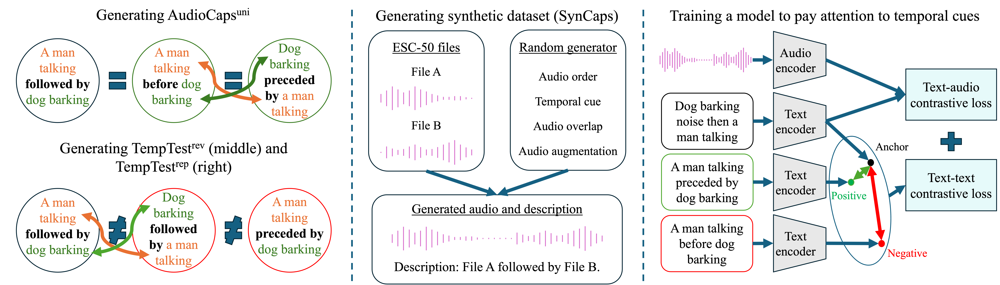

# 🎧 Dissecting Temporal Understanding in Text-to-Audio Retrieval [ACM Multimedia 2024]

[](https://github.com/oncescuandreea/DTU_text_audio/)
[](https://www.robots.ox.ac.uk/~vgg/research/audio-retrieval/dtu/)
[](https://arxiv.org/abs/2409.00851)
[](https://creativecommons.org/licenses/by-nc/4.0/)



---

## 🧭 Table of Contents
- [🧩 Environment Instructions](#-environment-instructions)
  - [🛠️ Environment Installation](#️-environment-installation)
- [📦 Setup: Download Pre-trained Models](#-setup-download-pre-trained-models)
  - [1️⃣ HTSAT Model](#1️⃣-htsat-model)
  - [2️⃣ WavCaps Model](#2️⃣-wavcaps-model)
- [🧪 Running the Model on AudioCaps](#-running-the-model-on-audiocaps)
  - [🔹 Training](#-training)
  - [🔹 Evaluation](#-evaluation)
- [🎵 Running the Model on Clotho](#-running-the-model-on-clotho)
  - [🔹 Training](#-training-1)
  - [🔹 Evaluation](#-evaluation-1)
- [🔁 Running the Model on SynCaps](#-running-the-model-on-syncaps)
  - [🔹 Training](#-training-2)
  - [🔹 Evaluation](#-evaluation-2)
- [🧬 Generating SynCaps](#-generating-syncaps)
- [📖 Citation](#-citation)
- [✉️ Contact](#️-contact)
- [🙏 Acknowledgements](#-acknowledgements)
- [⚖️ License](#-license)


## 🧩 Environment Instructions

### 🛠️ Environment Installation

```bash
conda env create -f environment.yml
conda activate egovlp
python -m nltk.downloader stopwords
export PYTHONPATH=.
```

---

## 📦 Setup: Download Pre-trained Models

### 1️⃣ HTSAT Model

Download the `HTSAT.ckp` model from [this Google Drive link](https://drive.google.com/drive/folders/1ZaYERuMMLLgu4oHTl47FcippLFboaGq5)  
and place it under:

```
retrieval/pretrained_models/audio_encoders/
```

More info can be found in the [WavCaps repo](https://github.com/XinhaoMei/WavCaps/tree/master/retrieval).

Alternatively, use the following commands:

```bash
cd retrieval
mkdir -p pretrained_models/audio_encoder
gdown --output pretrained_models/audio_encoder/HTSAT.ckpt "https://drive.google.com/uc?id=11XiCDsW3nYJ6uM87pvP3wI3pDAGhsBC1"
```

---

### 2️⃣ WavCaps Model

Download the pre-trained WavCaps model:

```bash
mkdir pretrained
gdown --output pretrained/HTSAT-BERT-PT.pt "https://drive.google.com/uc?id=1il6X1EiUPlbyysM9hn2CYr-YRSCuSy2m"
```

Then, update the `pretrain_path` in:

```
retrieval/settings/train_ac_trans.yaml
```

to point to the full path of your downloaded model.

---

## 🧪 Running the Model on **AudioCaps**

### 🔹 Training

From the `retrieval` folder, run:

```bash
python train.py   --config settings/train_ac_trans.yaml   --exp_name <experiment_name>   --lambda_new_loss 0   --val_filename val_audioset_5_orig   --train_filename train_audioset_orig   --test_filename test_full   --seed 18
```

**Notes:**
- Replace the `pretrain_path` in `settings/train_ac_trans.yaml` with your pretrained model path.
- Set `lambda_new_loss` to:
  - `10` → reproduce experiments using the additional loss.
  - `0` → use the standard text–audio contrastive loss.
- You can specify dataset versions:
  - **Original AudioCaps:**
    ```bash
    --train_filename train_audioset_orig     --val_filename val_audioset_5_orig     --test_filename test_full
    ```
  - **Uniform version:**
    ```bash
    --train_filename train_audioset_rearranged     --val_filename val_audioset_5_rearranged     --test_filename test_audioset_5_rearranged
    ```

Training logs and final results are saved under:

```
retrieval/outputs/<exp_name>/logging
```

---

### 🔹 Evaluation

To evaluate on AudioCaps (original version):

```bash
python test_improved.py   --config settings/inference_ac_orig.yaml   --exp_name <experiment_name>   --lambda_new_loss 0   --val_filename val_audioset_5_orig   --train_filename train_audioset_orig   --test_filename test_full   --seed 19
```

- Update the checkpoint path in:
  ```
  retrieval/settings/inference_ac_orig.yaml
  ```
- Pre-trained checkpoints used in the paper are available [here](https://drive.google.com/drive/folders/124fyrR7gVKyQgj7CO6aO-55_tUB9jXlV?usp=sharing).

---

## 🎵 Running the Model on **Clotho**

### 🔹 Training

Run the following from the `retrieval` folder:

```bash
python train.py   --config settings/train_clotho_trans.yaml   --exp_name clotho_train   --seed 18   --lambda_new_loss 10   --train_filename train_individual
```

Update the path of the pretrained model in:
```
retrieval/settings/train_clotho_trans.yaml
```

---

### 🔹 Evaluation

```bash
python test_improved.py   --config settings/inference_clotho.yaml   --exp_name clotho_eval   --lambda_new_loss 0   --train_filename train_individual   --seed 18
```

- Update the checkpoint path in:
  ```
  retrieval/settings/inference_clotho.yaml
  ```
- Paper checkpoints: [Google Drive link](https://drive.google.com/drive/folders/124fyrR7gVKyQgj7CO6aO-55_tUB9jXlV?usp=sharing).

---

## 🔁 Running the Model on **SynCaps**

### 🔹 Training

```bash
python train.py   --config settings/train_syncaps.yaml   --exp_name syncaps_train   --lambda_new_loss 0   --seed 19
```

---

### 🔹 Evaluation

```bash
python test_improved.py   --config settings/inference_syncaps.yaml   --exp_name syncaps   --lambda_new_loss 0   --seed 19
```

- Update the checkpoint path in:
  ```
  retrieval/settings/inference_syncaps.yaml
  ```
- Checkpoints used in the paper can be found [here](https://drive.google.com/drive/folders/124fyrR7gVKyQgj7CO6aO-55_tUB9jXlV?usp=sharing).

---

## 🧬 Generating SynCaps

To generate SynCaps, run:

```bash
python retrieval/tools/syncaps_gen.py
```

---

## 📖 Citation

If you find our work useful, please cite the following:

```bibtex
@InProceedings{Oncescu24,
  author       = {Andreea-Maria Oncescu and Joao~F. Henriques and A. Sophia Koepke},
  title        = {Dissecting Temporal Understanding in Text-to-Audio Retrieval},
  booktitle    = {ACM International Conference on Multimedia},
  month        = oct,
  year         = {2024},
  doi          = {https://doi.org/10.1145/3664647.3681690},
}

@article{mei2023wavcaps,
  title={WavCaps: A ChatGPT-Assisted Weakly-Labelled Audio Captioning Dataset for Audio-Language Multimodal Research},
  author={Mei, Xinhao and Meng, Chutong and Liu, Haohe and Kong, Qiuqiang and Ko, Tom and Zhao, Chengqi and Plumbley, Mark D and Zou, Yuexian and Wang, Wenwu},
  journal={arXiv:2303.17395},
  year={2023}
}

@inproceedings{piczak2015dataset,
  title = {{ESC}: {Dataset} for {Environmental Sound Classification}},
  author = {Piczak, Karol J.},
  booktitle = {{Association for Computing Machinery (ACM) Conference} on {Multimedia}},
  year={2015},
}
```

---

## ✉️ Contact

Maintained by [**Andreea**](https://github.com/oncescuandreea).  
For questions and discussions, contact:  
📩 `oncescuandreea@yahoo.com`

---

## 🙏 Acknowledgements

This codebase is based on [**WavCaps**](https://github.com/XinhaoMei/WavCaps/tree/master).

Supported by:
- EPSRC DTA Studentship  
- Royal Academy of Engineering (RF\201819\18\163)  
- DFG: SFB 1233, Project 276693517  
- DFG EXC 2064/1 – Project 390727645  

Special thanks to **Samuel Albanie** and **Bruno Korbar** for helpful feedback and suggestions.

---

## ⚖️ License

This work is licensed under a  
**Creative Commons Attribution–NonCommercial International 4.0 License**.
